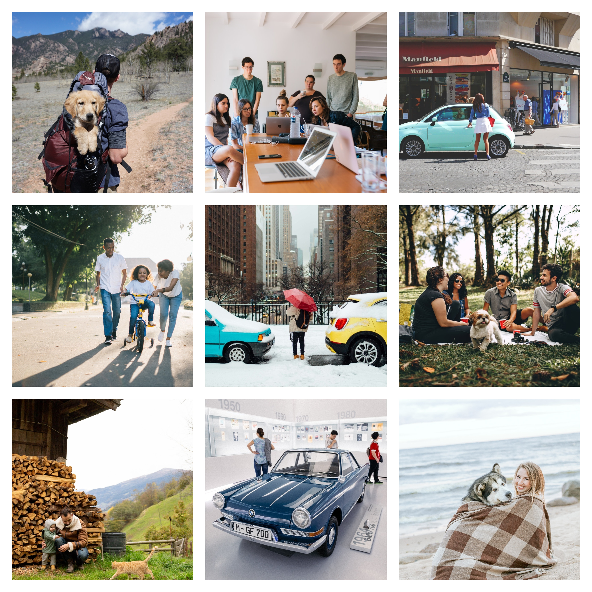
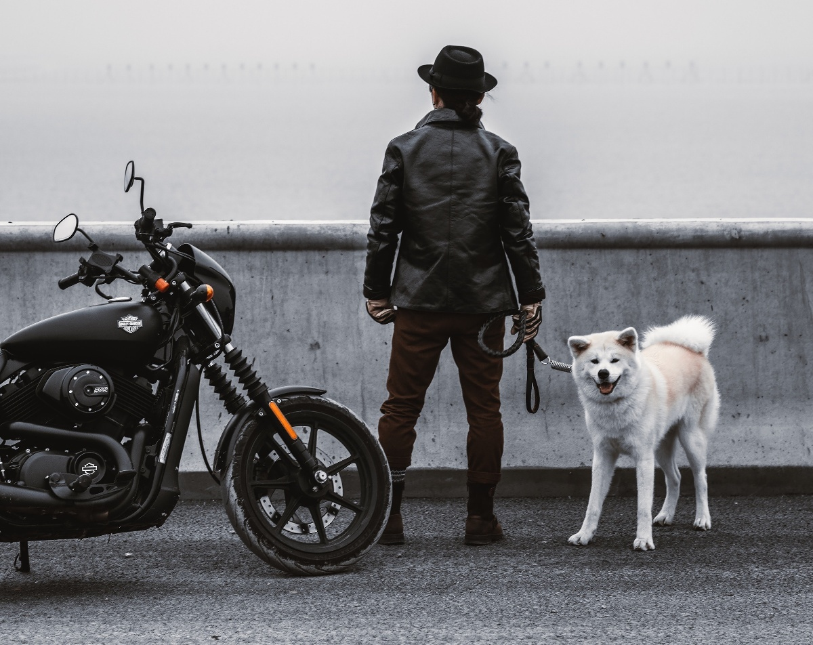

 

  

# Demo Images  

  <a href="#overview">Overview</a> •
  <a href="#examples">Examples</a>

 

## Overview 

This project contains 17 unlabeled images: 2 datasets with 12 and 5 images repectively. It is ideal for running quick tests (for example, inference of pretrained neural networks). 

## Examples

  
